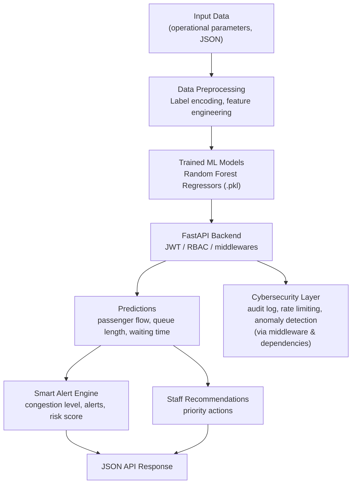

# Smart Airport Command Center

An AI-powered airport operations system that predicts **passenger flow**, **queue length**, and **waiting time**, then turns those predictions into **congestion alerts**, **security risk scores**, and **staff deployment recommendations** — wrapped in a FastAPI REST API with JWT authentication, role-based access control, and a cybersecurity layer.

**API version:** 2.0.0

This repository is the **backend Phase 1 / Phase 2** result. The **RAG/LLM assistant and the frontend dashboard are not implemented yet** (see [Project Status](#project-status)).

---

## Table of Contents

- [Project Overview](#project-overview)
- [Problem Statement](#problem-statement)
- [Project Objectives](#project-objectives)
- [Main Features](#main-features)
- [System Architecture](#system-architecture)
- [Technology Stack](#technology-stack)
- [Machine Learning Module](#machine-learning-module)
- [Dataset](#dataset)
- [Backend API](#backend-api)
- [Authentication and Authorization](#authentication-and-authorization)
- [Cybersecurity Features](#cybersecurity-features)
- [Smart Features](#smart-features)
- [Project Structure](#project-structure)
- [Installation and Setup](#installation-and-setup)
- [How to Run](#how-to-run)
- [API Testing](#api-testing)
- [Testing](#testing)
- [Known Limitations](#known-limitations)
- [Future Improvements](#future-improvements)
- [Project Status](#project-status)

---

## Project Overview

Modern airports handle thousands of passengers per day. Terminal congestion, long security queues, and uneven staffing cause delays and a poor passenger experience. Operators usually react *after* a problem becomes visible rather than acting on a forecast.

The Smart Airport Command Center tackles this by combining **machine learning predictions** with a **FastAPI backend**:

1. A **synthetic airport operations dataset** is used to train three regression models.
2. Models predict **how many passengers** will be in the terminal, **how long the security queue** will be, and **how long passengers will wait**.
3. The FastAPI backend exposes these predictions as REST endpoints.
4. A **smart alert engine** converts predictions into congestion levels, alerts, and a 0-100 **Security Risk Score**.
5. A **staff recommendation engine** suggests concrete actions (e.g., "open 2 additional check-in counters").
6. A **cybersecurity layer** protects the API with JWT login, roles, rate limiting, audit logging, and anomaly detection.

The goal is to give airport operators **forecast-driven, actionable information** instead of reactive guesses.

---

## Problem Statement

- **Airport congestion** — terminals are over capacity at peak times, harming operations and passenger experience.
- **Passenger queues** — long queues build up at check-in and security screening with little advanced warning.
- **Waiting times** — passengers cannot estimate how long they will wait, and operators cannot plan screening lane capacity.
- **Resource and staff allocation** — staff are distributed reactively; there is no data-driven guidance on where and when to deploy them.
- **Passenger experience** — delays and crowding create stress, missed flights, and negative perception of the airport.

---

## Project Objectives

- **Passenger flow prediction** — forecast the number of passengers in the terminal from operational parameters.
- **Queue length prediction** — forecast the number of people waiting at security.
- **Waiting time prediction** — forecast average waiting time in minutes.
- **Congestion detection** — translate predictions into a congestion level (MINIMAL/LOW/MODERATE/HIGH/CRITICAL).
- **Smart alerts** — generate severity-based alerts when operational thresholds are exceeded.
- **Staff recommendations** — propose staffing actions based on predicted conditions.
- **API security** — protect the API with JWT authentication, role-based access control, rate limiting, audit logging, and anomaly detection.

---

## Main Features

### Implemented (verified)

- **Three ML prediction endpoints** — passenger flow, queue length, waiting time (Random Forest Regressors).
- **Full analysis endpoint** — runs all three predictions plus congestion, alerts, recommendations, and risk score in one call.
- **Manual alert evaluation** — test thresholds/scenarios without running the ML models.
- **Smart alert engine** — threshold-based alerts with severity and category, configurable via `.env`.
- **Congestion detection** — weighted congestion score (0-100) mapped to five levels.
- **Security Risk Score** — weighted 0-100 risk score computed from predictions and congestion.
- **Staff recommendation engine** — rule-based, priority-sorted staffing recommendations.
- **JWT authentication** — login endpoint issues bearer tokens (HS256, 60-minute expiry).
- **Role-based access control** — `admin`, `operator`, `viewer` roles with endpoint-level restrictions.
- **Security headers middleware** — `X-Content-Type-Options`, `X-Frame-Options`, `X-XSS-Protection`, `Strict-Transport-Security`, `Cache-Control`.
- **Rate limiting** — in-memory sliding window (default 100 requests / 60 s per IP, returns `429`).
- **Audit logging** — JSON-lines audit log at `backend/logs/audit.log`.
- **Anomaly detection** — per-IP rule-based scoring plus an optional Isolation Forest model.
- **Failed login tracking** — failed logins are recorded and feed the anomaly detector.
- **Authorization failure tracking** — denied RBAC requests are audited.
- **Security administration APIs** — status, logs, and anomaly-check endpoints (admin only).
- **Administration of thresholds via `.env`** — alert and rate-limit thresholds are configurable at runtime start.
- **Automated tests** — pytest suite (50 tests) and smoke test, currently passing.

### Partially implemented

- **User store** — users are stored in-memory with bcrypt-hashed passwords. There is **no user management API** (register/update/delete) and no database persistence.

### Planned / not implemented

- **RAG/LLM assistant** — only placeholder stubs exist (`backend/app/services/rag_service.py`, `backend/app/api/rag.py`); the RAG router is **not registered** in `app/main.py` and the `rag/` directory contains empty scaffolding.
- **Frontend dashboard** — the `frontend/` directory contains only empty scaffolding (no code, empty `README.MD` and `LICENSE`).

---

## System Architecture



**Working flow**

1. A client sends operational parameters (`hour`, `terminal`, staff counts, weather, etc.) as JSON.
2. The backend preprocesses the input — label-encodes categorical fields and derives extra features.
3. The three trained Random Forest models produce predictions.
4. The alert engine evaluates the predictions against configurable thresholds.
5. The recommendation engine proposes staffing actions.
6. The response returns predictions together with congestion level, alerts, risk score, and recommendations.
7. Every protected call is authenticated (JWT), role-checked (RBAC), rate-limited, audited, and observed by the anomaly detector.

---

## Technology Stack

| Component | Technology | Used for |
| --- | --- | --- |
| Language | Python 3 (developed/tested on 3.13; code requires 3.9+) | All backend code |
| Web framework | FastAPI | REST API, automatic OpenAPI docs |
| ASGI server | Uvicorn | Running the application |
| Data handling | Pandas, NumPy | Dataset loading, preprocessing, feature engineering |
| Machine learning | Scikit-learn 1.9.0 | `RandomForestRegressor`, `LinearRegression`, `LabelEncoder`, `IsolationForest`, metrics |
| Model serialization | Joblib | Saving/loading `.pkl` models and encoders |
| Configuration | Pydantic, pydantic-settings, python-dotenv | Settings from `.env` |
| Authentication | python-jose, bcrypt, python-multipart | JWT signing/verification, password hashing, OAuth2 form login |
| Testing | Pytest, httpx, requests | pytest suite, test client, live-server scripts |

Verified in `backend/requirements.txt` and the installed root `.venv`.

---

## Machine Learning Module

### Models

Three separate regressors are trained and deployed (one per prediction target). **Random Forest Regressor** is the selected/primary model; **Linear Regression** is trained for comparison only.

| Model | Prediction target | Algorithm used for inference |
| --- | --- | --- |
| `passenger_flow` | Number of passengers in the terminal | Random Forest Regressor |
| `queue_length` | People waiting in the security queue | Random Forest Regressor |
| `waiting_time` | Average waiting time in minutes | Random Forest Regressor |

### Preprocessing and feature engineering

Performed in `backend/app/services/preprocessing.py` (`DataPreprocessor` for training, `preprocess_single_input` for live inference):

- **Cleaning** — duplicate removal, median imputation for missing values.
- **Encoding** — `LabelEncoder` for `terminal` (T1/T2/T3) and `weather` (Clear/Rainy/Foggy). Encoders are saved with the models.
- **Derived features** — `total_staff`, `staff_per_flight`, and time flags `is_morning`, `is_afternoon`, `is_evening`, `is_night`.

The canonical feature list (`FEATURE_COLUMNS`) contains **19 features** shared between training and inference.

### Training pipeline

`backend/scripts/generate_dataset.py` creates the synthetic dataset, then `backend/scripts/train_models.py`:

1. Loads and preprocesses the data,
2. Splits into 80% training / 20% test (`random_state=42`),
3. Trains Random Forest (`n_estimators=100`, `max_depth=20`) and Linear Regression,
4. Evaluates both with MAE, MSE, RMSE, and R²,
5. Saves models + encoders via Joblib and metrics to `backend/models/model_metrics.json`.

### Model loading

On startup, the FastAPI lifespan calls `prediction_service.load_all_models()` (see `backend/app/main.py`). The health endpoint reports which models loaded and their metrics. Missing models degrade gracefully with a warning.

### Evaluation metrics

Values below are the Random Forest **test-set** metrics stored in `backend/models/model_metrics.json`. **They reflect the synthetic dataset only and must not be read as real-world airport accuracy.**

| Target | R² | RMSE | MAE |
| --- | --- | --- | --- |
| passenger_flow | 0.9731 | 509.14 | 338.46 |
| queue_length | 0.6264 | 14.48 | 6.71 |
| waiting_time | 0.6697 | 11.60 | 9.31 |

---

## Dataset

| Item | Value |
| --- | --- |
| Location | `backend/datasets/raw/airport_data.csv` |
| Size | **5,000 records** (verified) |
| Generation script | `backend/scripts/generate_dataset.py` |
| Generation seed | `random_state = 42` |
| Coverage | Simulated 30-day operations cycle |
| Type | **Synthetic** (generated for demonstration, not collected from a real airport) |

**Columns (17):** `timestamp` + 13 operational input features:

`hour, day_of_week, is_weekend, is_peak_hour, terminal, num_flights, security_staff, checkin_staff, gates_available, weather, is_holiday_season, baggage_volume, international_ratio`

+ 3 target variables:

- `passenger_flow` (passengers)
- `queue_length` (people, generated in the 5-200 range)
- `waiting_time` (minutes, generated in the 5-120 range)

**Limitations:** the data is synthetic — relationships are algorithmically generated with a fixed seed. Metrics derived from it are **not** real-world accuracy claims, and the capped ranges (queue ≤ 200, wait ≤ 120) mean predictions saturate near those bounds.

---

## Backend API

Base URL: `http://localhost:8000`. Interactive docs: `/docs` (Swagger UI) and `/redoc`.

All endpoints verified against the registered FastAPI routes.

| Method | Endpoint | Description | Authentication |
| --- | --- | --- | --- |
| GET | `/` | Service info and endpoint map | Public |
| GET | `/api/health` | Status, version, uptime, loaded models, model metrics | Public |
| POST | `/api/auth/login` | Login (form: `username`, `password`) → JWT token | Public |
| GET | `/api/auth/me` | Current authenticated user info | Any valid token |
| POST | `/api/predict/passenger-flow` | Predict passenger flow (with alerts, risk score, recommendations) | Operator, Admin |
| POST | `/api/predict/queue-length` | Predict queue length (with alerts, risk score, recommendations) | Operator, Admin |
| POST | `/api/predict/waiting-time` | Predict waiting time (with alerts, risk score, recommendations) | Operator, Admin |
| POST | `/api/alerts/check` | Full analysis: all three predictions + congestion + alerts + risk score + recommendations | Operator, Admin |
| POST | `/api/alerts/evaluate` | Alert evaluation from manually supplied metrics (no ML) | Operator, Admin |
| GET | `/api/security/status` | Security system status, anomaly detector state, audit stats | Admin |
| GET | `/api/security/logs` | Audit logs (`limit`, optional `user`/`action` filters) | Admin |
| POST | `/api/security/check` | Anomaly detection check (optional `ip_address` body) | Admin |

**Prediction input schema** (`PredictionInput`):

| Field | Type | Constraints | Description |
| --- | --- | --- | --- |
| hour | int | 0-23 | Hour of day |
| day_of_week | int | 0-6 | 0=Monday, 6=Sunday |
| is_weekend | int | 0-1 | Weekend flag |
| is_peak_hour | int | 0-1 | Peak hour flag |
| terminal | str | T1, T2, T3 | Terminal |
| num_flights | int | ≥ 1 | Scheduled flights |
| security_staff | int | ≥ 1 | Security staff count |
| checkin_staff | int | ≥ 1 | Check-in staff count |
| gates_available | int | ≥ 1 | Available gates |
| is_holiday_season | int | 0-1 | Holiday season flag |
| baggage_volume | int | ≥ 0 | Expected baggage volume |
| international_ratio | float | 0.0-1.0 | International flight ratio |
| weather | str | Clear, Rainy, Foggy | Weather condition |

---

## Authentication and Authorization

### JWT authentication

- `POST /api/auth/login` accepts `username`/`password` (OAuth2 form) and returns an `access_token` (`token_type: bearer`).
- Tokens are signed with **HS256** using `SECRET_KEY` (configurable). Default expiry is **60 minutes** (`ACCESS_TOKEN_EXPIRE_MINUTES`).
- Passwords are hashed with **bcrypt**.
- Protected endpoints read the token from the `Authorization: Bearer <token>` header.
- Invalid/expired/missing tokens return `401`; granted tokens without the required role return `403`.

### Roles and permissions

| Permission | viewer | operator | admin |
| --- | :---: | :---: | :---: |
| Login / `/api/auth/me` | yes | yes | yes |
| Predictions (`/api/predict/*`) | no | yes | yes |
| Alerts (`/api/alerts/*`) | no | yes | yes |
| Security (`/api/security/*`) | no | no | yes |

Role checks are enforced via the `require_role()` dependency in `backend/app/cybersecurity/auth.py`.

### Important

- Users are stored **in-memory** (bcrypt-hashed) in `backend/app/cybersecurity/rbac.py`. There is no database and no registration endpoint.
- **No secrets or real credentials are exposed in this document.** The default development users are documented below only because they are hard-coded in the source and needed for local testing. Change the `SECRET_KEY` and users before any deployment.

---

## Cybersecurity Features

All modules live in `backend/app/cybersecurity/`.

| Feature | Implementation | Verified behavior |
| --- | --- | --- |
| Security headers | `SecurityHeadersMiddleware` | Adds `X-Content-Type-Options: nosniff`, `X-Frame-Options: DENY`, `X-XSS-Protection: 1; mode=block`, `Strict-Transport-Security`, `Cache-Control: no-store` to all responses |
| Rate limiting | `RateLimitMiddleware`, in-memory sliding window | Default 100 requests / 60 s per IP; excess returns `429` |
| Audit logging | `audit_logger` (`audit.py`) | JSON-lines appended to `backend/logs/audit.log` with `timestamp`, `user`, `action`, `endpoint`, `status`, `ip_address`, `details` |
| Anomaly detection | `anomaly_detector` (`anomaly_detection.py`) | Rule-based scoring + optional Isolation Forest per IP; features: request rate, unique endpoints, failed logins, 30-second burst score |
| Failed login tracking | Login failures recorded to anomaly detector | Repeated failures raise the per-IP anomaly score |
| Authorization failure tracking | `authorization_failed` audit events | Denied RBAC requests are logged |
| Admin security APIs | `/api/security/*` | Status, filtered logs, per-IP anomaly checks (admin only) |

**Threat levels** (anomaly score 0-100): `normal` (< 35), `suspicious` (35-69), `critical` (≥ 70). The Isolation Forest model trains in memory once enough request history has accumulated.

### Limitations of the in-memory security state

Rate limiting and anomaly detection state live **in memory**: it resets on restart, is per-process, and is not shared across multiple server instances. This is suitable for development and single-instance deployments; production scale-out needs a shared store (e.g., Redis). Audit logs are **file-based** (JSON-lines), not a database.

---

## Smart Features

### Alert thresholds

Configured in `backend/app/core/config.py` and overridable in `backend/.env`:

| Metric | HIGH / CRITICAL threshold | MEDIUM threshold |
| --- | --- | --- |
| Queue length (people) | 100 | 50 |
| Waiting time (minutes) | 45 | 25 |
| Passenger flow | 8,000 | 5,000 |

### Congestion detection

A 0-100 **congestion score** is a weighted combination of the normalized metrics — passenger flow 40%, queue length 35%, waiting time 25% (normalized against the thresholds above).

| Score | Level |
| --- | --- |
| ≥ 85 | CRITICAL |
| 70-84 | HIGH |
| 45-69 | MODERATE |
| 20-44 | LOW |
| < 20 | MINIMAL |

HIGH/CRITICAL congestion triggers an alert of category `congestion`.

### Security Risk Score

A 0-100 risk score from the same metrics — passenger flow 25%, queue length 25%, waiting time 20%, congestion level 15%, alert severity 15%. Higher values mean a riskier operational state.

### Alert severities and categories

Severities: `critical`, `high`, `medium`, `low`, `info`. Generated alert categories: `congestion`, `capacity`, `delay`. Each alert carries `severity`, `category`, `message`, `metric`, `value`, and `threshold`. An `info` alert is returned when all metrics are within normal ranges.

### Staff recommendations

Rule-based engine (`backend/app/services/staff_recommendation.py`) producing priority-sorted actions (`critical`/`high`/`medium`/`low`/`info`) with a `recommendation` and `reason`, for categories including check-in, security, operations, crowd management, and efficiency. For example:

- Queue length beyond the high threshold and high passenger flow → "Open 2-3 additional check-in counters immediately."
- Waiting time beyond the high threshold → "Deploy 5+ additional security staff" and "Open additional security screening lanes."
- Passenger flow beyond capacity → "Activate overflow management protocol."
- Low utilization → "Consider reducing staff by 10-20% during this period."
- All clear → "Current staffing levels are adequate."

---

## Project Structure

```text
Smart Airport Command Center/
├── README.md                         # This file
├── .gitignore
├── docs/                             # Project documentation
│   ├── BACKEND_DOCUMENTATION.md
│   ├── API_USAGE_GUIDE.md
│   ├── WEEK3_IMPLEMENTATION_SUMMARY.md
│   └── reports/
│       └── WEEK3_ML_REPORT.md
│
├── backend/
│   ├── .env.example                  # Configuration template (copy to .env)
│   ├── requirements.txt
│   ├── app/
│   │   ├── main.py                   # FastAPI app: middleware + routers + lifespan
│   │   ├── api/                      # API routers
│   │   │   ├── health.py
│   │   │   ├── passenger.py
│   │   │   ├── queue.py
│   │   │   ├── waiting.py
│   │   │   ├── alerts.py
│   │   │   ├── security_api.py
│   │   │   └── rag.py                # Placeholder only (not registered)
│   │   ├── core/
│   │   │   ├── config.py             # Settings, thresholds
│   │   │   └── security.py           # JWT + password hashing utilities
│   │   ├── cybersecurity/
│   │   │   ├── auth.py               # Login, token validation, role dependency
│   │   │   ├── rbac.py               # Roles, in-memory user store
│   │   │   ├── middleware.py         # Rate limiter + security headers
│   │   │   ├── audit.py              # JSON-lines audit logger
│   │   │   └── anomaly_detection.py  # Anomaly detector (rules + Isolation Forest)
│   │   ├── models/
│   │   │   └── schemas.py            # Pydantic request/response schemas
│   │   ├── services/
│   │   │   ├── preprocessing.py
│   │   │   ├── prediction.py
│   │   │   ├── alerts.py             # Smart alert engine
│   │   │   ├── staff_recommendation.py
│   │   │   └── rag_service.py        # Placeholder only
│   │   └── utils/
│   │       └── helper.py             # Empty utility placeholder
│   ├── datasets/
│   │   └── raw/
│   │       └── airport_data.csv      # Synthetic dataset (5,000 records)
│   ├── models/                       # Trained models, encoders, metrics
│   │   ├── passenger_flow_model.pkl
│   │   ├── passenger_flow_encoders.pkl
│   │   ├── queue_length_model.pkl
│   │   ├── queue_length_encoders.pkl
│   │   ├── waiting_time_model.pkl
│   │   ├── waiting_time_encoders.pkl
│   │   └── model_metrics.json
│   ├── scripts/
│   │   ├── generate_dataset.py       # Create the synthetic dataset
│   │   └── train_models.py           # Train and save models
│   ├── logs/
│   │   └── audit.log                 # Audit log (git-ignored, auto-created)
│   └── tests/
│       ├── conftest.py               # Shared pytest fixtures
│       ├── test_backend.py           # Main suite (50 tests)
│       ├── smoke_test.py             # Startup smoke test
│       └── test_api*.py              # Live-server scripts (need a running server)
│
├── frontend/                         # EMPTY scaffolding only (not implemented)
├── rag/                              # EMPTY scaffolding only (documents/embeddings/vector_db)
└── models/                           # EMPTY (models live in backend/models/)
```

---

## Installation and Setup

These commands target **Windows PowerShell**. The project path contains spaces, so paths are quoted.

### 1. Navigate to the project

```powershell
Set-Location -LiteralPath "C:\Users\rudra\OneDrive\Desktop\Smart Airport Command Center"
Set-Location backend
```

### 2. Python environment

```powershell
python -m venv .venv
.\.venv\Scripts\Activate.ps1
```

> Note: the repository already contains a working `.venv` at the project root (Python 3.13) — it was used to verify the test suite. The `backend\venv` folder is **not** usable for tests/the test client (it lacks `httpx` with a compatible version); create a fresh environment rather than reusing it.

### 3. Install dependencies

```powershell
pip install -r requirements.txt
```

### 4. Configure `.env`

```powershell
Copy-Item .env.example .env
```

Then open `backend\.env` and set a strong random value for `SECRET_KEY`:

```text
SECRET_KEY=<a-long-random-string>
```

The application starts with a development default key and **prints a warning** if the default is still in use — a real key must be configured before any deployment. Thresholds for alerts and rate limiting are also configurable here.

### 5. Model availability

Pre-trained models and encoders ship in `backend/models/` (`.pkl` files) and are loaded at startup. If you want to regenerate them from scratch:

```powershell
python scripts/generate_dataset.py
python scripts/train_models.py
```

This regenerates `backend/datasets/raw/airport_data.csv` and rewrites the `.pkl` models and `model_metrics.json`.

### 6. Start the backend

```powershell
python -m uvicorn app.main:app --reload
```

The API will be available at `http://localhost:8000`.

---

## How to Run

Copy-paste sequence (run from the repository root):

```powershell
# 1. Navigate to the backend
Set-Location -LiteralPath "C:\Users\rudra\OneDrive\Desktop\Smart Airport Command Center\backend"

# 2. Activate the virtual environment (create one first if needed)
.\.venv\Scripts\Activate.ps1

# 3. Start the FastAPI server
python -m uvicorn app.main:app --reload
```

Open in a browser:

- Swagger UI: `http://localhost:8000/docs`
- ReDoc: `http://localhost:8000/redoc`
- Health check: `http://localhost:8000/api/health`

Run the automated tests (from the `backend` directory, with the venv active):

```powershell
python -m pytest tests/test_backend.py -v
python -m pytest tests/smoke_test.py -v
```

> The `tests/test_api*.py` scripts expect a **live running server** and are launched directly with `python`: `python tests/test_all_endpoints.py`.

---

## API Testing

### Using Swagger UI

1. Start the server and open `http://localhost:8000/docs`.
2. Use `POST /api/auth/login` (form fields `username` and `password`) to obtain a token.
3. Click **Authorize** on the top right and paste the token.
4. Call prediction, alert, and security endpoints with the sample JSON provided in each schema.

### Bearer token

Every protected request must include:

```
Authorization: Bearer <access_token>
```

### Development users (development only)

These credentials are hard-coded in the source for local testing. **They are not production credentials** — replace the user store and `SECRET_KEY` before any deployment.

| Role | Username | Password |
| --- | --- | --- |
| Admin | admin | admin123 |
| Operator | operator | operator123 |
| Viewer | viewer | viewer123 |

### Example: login and predict (PowerShell)

```powershell
$token = (Invoke-RestMethod -Method Post -Uri "http://localhost:8000/api/auth/login" `
  -Body @{username="operator"; password="operator123"} `
  -ContentType "application/x-www-form-urlencoded").access_token

$body = @{
  hour = 8; day_of_week = 1; is_weekend = 0; is_peak_hour = 1
  terminal = "T1"; num_flights = 25; security_staff = 30; checkin_staff = 20
  gates_available = 15; is_holiday_season = 0; baggage_volume = 3500
  international_ratio = 0.6; weather = "Clear"
} | ConvertTo-Json

Invoke-RestMethod -Method Post -Uri "http://localhost:8000/api/alerts/check" `
  -Headers @{Authorization = "Bearer $token"} `
  -Body $body -ContentType "application/json"
```

### Admin security APIs

With an **admin** token you can also query `/api/security/status`, `/api/security/logs?limit=20`, and `POST /api/security/check` (optionally with body `{"ip_address": "192.0.2.5"}`).

### Error codes

- `401` — missing/invalid/expired token.
- `403` — valid token but insufficient role (e.g., viewer calling predictions, operator calling security).
- `422` — invalid input (e.g., `hour: 25`, `terminal: "T9"`, negative value).
- `429` — rate limit exceeded.

---

## Testing

The test suite was executed during documentation to verify every claim:

| Suite | Command (from `backend`, venv active) | Result |
| --- | --- | --- |
| Main suite | `python -m pytest tests/test_backend.py -v` | **50 passed** |
| Smoke test | `python -m pytest tests/smoke_test.py -v` | **1 passed** |

Coverage in `tests/test_backend.py` includes: app startup and route registration, health, ML model loading and metrics, all three prediction endpoints, full analysis, manual alert evaluation, input validation, login (success/failure/unknown), JWT validity/expiry, RBAC restrictions, rate limiting, audit logging (including failed login and authorization failure events), anomaly detection, smart alerts, congestion detection, staff recommendations, security endpoints, error handling, and an end-to-end integration flow.

**Warnings** observed (non-failing):

- `StarletteDeprecationWarning`: `httpx` with `starlette.testclient` is deprecated; the environment recommends `httpx2`.
- ~900 `DeprecationWarning`s from Joblib/NumPy about setting array shape (NumPy 2.5).

**Live verification:** a running server instance returned `status: healthy` with all three models loaded (`passenger_flow`, `queue_length`, `waiting_time`).

**Known test constraint:** `backend\venv` is incompatible with the FastAPI `TestClient`; the tests were run with the project root `.venv`.

---

## Known Limitations

- **Synthetic dataset** — all models are trained on generated data, not data collected from a real airport.
- **Metrics are not real-world accuracy** — the R²/RMSE/MAE values describe fit on the synthetic test set only.
- **Prediction saturation** — the synthetic targets are capped (`queue_length` ≤ 200, `waiting_time` ≤ 120), so predictions saturate near these bounds and extreme inputs can trigger frequent HIGH/CRITICAL congestion alerts.
- **In-memory rate limiting** — sliding-window state resets on restart and is per-process; not shared across multiple instances.
- **In-memory anomaly state** — request history and Isolation Forest model state are lost on restart.
- **In-memory user store** — three default users, no user management API, no persistence.
- **File-based audit logs** — `backend/logs/audit.log` grows with each event; there is no log rotation or database.
- **RAG/LLM assistant** — incomplete; only placeholder files exist and the router is not registered.
- **Frontend** — not implemented; `frontend/` is empty scaffolding.
- **CORS** — configured with `allow_origins=["*"]`, suitable for development only.
- **Local development environment quirks** — the `backend\venv` is broken for the test client; use the root `.venv` or a fresh environment.

---

## Future Improvements

All of the following are **planned future work**, not implemented features:

- **Real airport dataset** — replace the synthetic data with real operational statistics to obtain meaningful accuracy.
- **RAG / LLM assistant** — implement the placeholder service/API: vector database, embedding model, LLM provider, and register the router in `app/main.py`.
- **Frontend dashboard** — build the empty `frontend/` scaffolding into a dashboard (the backend endpoints are already designed for it).
- **Database integration** — e.g., PostgreSQL for persistent users, audit logs, and metrics; add a user-management API.
- **Persistent security state** — Redis-backed rate limiting and anomaly detection for multi-instance deployments.
- **Real-time data streaming** — simulated IoT data feeds into the prediction endpoints.
- **Production hardening** — HTTPS, strict CORS allow-list, real secret management, rate-limit tuning, prediction caching, load balancing.

---

## Project Status

| Area | Status | Evidence |
| --- | --- | --- |
| Backend core (Phase 1) | **Completed** | 3 ML prediction endpoints, alerts, congestion, staff recommendations verified in source |
| Backend cybersecurity (Phase 2) | **Completed** | JWT, RBAC, rate limiting, audit, anomaly detection, security APIs verified in source |
| Automated tests | **Passing** | 50/50 `test_backend.py` + 1/1 smoke test (executed during documentation) |
| Live API verification | **Verified** | Running server: `/api/health` healthy, 3 models loaded |
| RAG / LLM assistant | **Incomplete / planned** | Placeholder stubs only; router not registered |
| Frontend dashboard | **Planned / not implemented** | Empty scaffolding only |
| Dataset | **Synthetic** | 5,000 generated records; real airport data planned |

---

## Related Documentation

- `docs/API_USAGE_GUIDE.md` — detailed API reference with curl/Python examples.
- `docs/BACKEND_DOCUMENTATION.md` — architecture, cybersecurity layer, RAG status.
- `docs/WEEK3_IMPLEMENTATION_SUMMARY.md` and `docs/reports/WEEK3_ML_REPORT.md` — ML implementation and metrics detail.